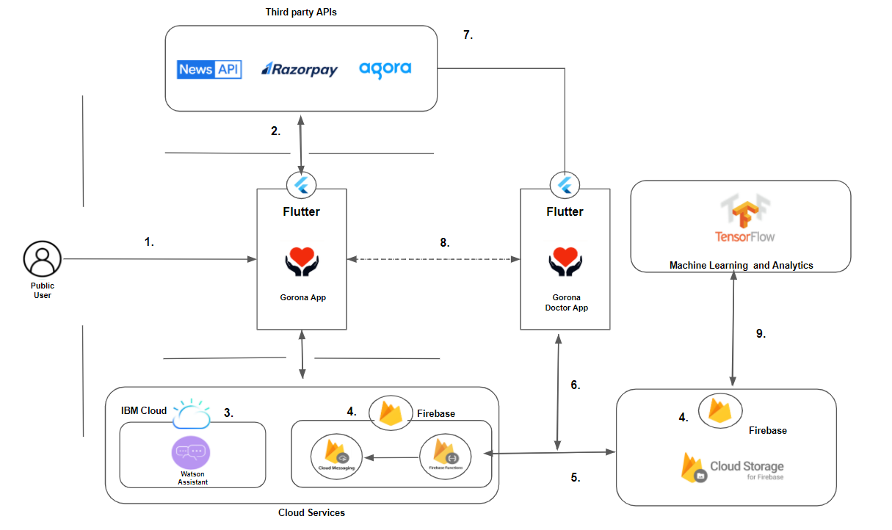

# PROJECT GORONA

Project Gorona is a COVID-19 resilience app that aims to solve the widespread problems caused by the pandemic and country lockdown.	


## Contents

1. [Short description](#short-description)
1. [Demo video](#demo-video)
1. [The architecture](#the-architecture)
1. [Long description](#long-description)
1. [Getting started](#getting-started)
1. [Running the tests](#running-the-tests)
1. [Live demo](#live-demo)
1. [Built with](#built-with)
1. [Author](#author)
1. [Feedback](#feedback)

## Short description

### What's the problem?

Covid-19 pandemic has affected millions of people's lives and livelihood worldwide. Containing the virus and getting back to the new normal is equally important. Covid-19 has caused a severe impact in
Education
Entertainment
Business
Healthcare

Different Tracks of Problems due to Covid-19 pandemic and Lockdown:

1.Prevention & containment: Stay home

2.Diagnosis, treatment & therapeutic management

3.Recovery and return to normal

4.Systemic solutions for crisis & pandemic management

### How can technology help?

Technology can help connect the people all over the world during this lockdown period.It help the healthcare department by connecting the Covid-19 prone patients with the data from the app.It can also help contain and prevent community spread.Entertain the people at home and encourage them to stay at home.

### The idea

Project Gorona is a user-friendly Covid-19 resilience app that aims to solve multiple problems caused by the Covid-19 pandemic and country lockdown.
It Solves the following problems:
1. Diagnosis and Treatment virtually and helping tele-communication decreasing the probablity of community spread.
2. Contact tracing and Containment by using the app location and bluetooth tethering.
3. Recovery to the new normal -Adapting to the new work environment
4. Fund raising for the nation to fight this pandemic.
5. Interest based Education to encourage students find their passion during this lockdown time.
6. Helping users with necessary navigation to the covid relief centers.


## Demo video

[](https://youtu.be/YkK4N0BTXWU)

## The architecture



1. Registering as a user and interacting with the Gorona app
2. Interfacing third party apps :
    i.   Razorpay payment gateway
    ii.  News.api News articles
    iii. Agora.io in-app Video calling 
3. Training the IBM watson chatbot
4. Creating Firebase authentication and cloud messaging for push notifications(Periodic covid checkup alerts)
5. Firestore as backend database to store user data.
6. Connecting doctor app and user app via cloud technology and updating the doctor state in database.
7. Creating channels in agora.io for in-app video calling facility.
8. Virtually connecting the doctor and patient via chatbot.
9. Firestore with Tensorflow for machine learning and analytics to improve user interaction and improvise business model.

	
## Long description

[More detail is available here](DESCRIPTION.md)

## File Details

1. [Flutter - gorona app source code](gorona)
1. [Watson dialog skill](chatbot_skills)
1. [App UI screenshots](screenshots)

## Getting started

These instructions will get you a copy of the project up and running on your local machine. Follow the instructions to run the app on your phone or emulator.Note that the source code support android devices.However as per the road map the app can be deployed in IOS devcies in the future.

### Prerequisites

1. [Flutter SDK](https://flutter.dev/docs/get-started/install)
1. [Watson Assistant](https://www.ibm.com/in-en/cloud/watson-assistant)
1. [Razorpay API](https://dashboard.razorpay.com/app/dashboard)
1. [News API](https://newsapi.org/)
1. [Agora API](https://www.agora.io/en/)
1. [Google Maps API](https://cloud.google.com/maps-platform)
1. [Firebase](https://firebase.google.com/)

### Installing

1. Install the flutter SDK and add it to you path

2. Register the above gievn API services and create a firebase account with a new project and replace the google-services.json file in the [app]() directory

3. Activate the IBM watson assistant resource and import the dialog skill from the [Chatbot-skills](chatbot_skills) folder. Make note of the API Key, Assistant ID and Assistant url.

4. goto the [secret.dart](gorona/lib/secret.dart) and enter your API credentials

Run the following command in the terminal

```bash
flutter pub get
flutter run
```
Try these in the Covid-19 Bot Session

1. What is Covid-19?
2. My child is stressed about the crisis how can I help?
3. How are businesses affected in COVID-19?
4. Can corona virus affect the pets?
5. what are my work from home options?
6. Where are the Quarantine Centers near my place?
7. Where are the hunger relief centers near me?

Try these in the Health Plus Chat Session

1. I'm not feeling well.I have a fever and vomiting.
2. I'm feeling sick and depressed.
3. My kid is not feeling well.She is having diarrhea.

## Live demo

Install the apk file from [here](https://drive.google.com/file/d/1twJmd0w-1ixiijQK6gILVTG_VNoOBJPi/view?usp=sharing) or see a detailed video on what a client side umbrella app can do [here]()

## Built with

###Gorona app
* [IBM Watson](https://www.ibm.com/in-en/cloud/watson-assistant) - To build the interactive chatbot
* [Firebase](https://firebase.google.com/) - For authentication and analytics
* [Firebase Cloud Functions](https://cloud.ibm.com/catalog?search=cloud%20functions#search_results) - To recieve data from the server and send it via FCM
* [Firebase Cloud Messaging](https://firebase.google.com/products/cloud-messaging?gclid=Cj0KCQjwgo_5BRDuARIsADDEntT36LgedgHS2eDUuQ_RI52la_ePy6SttLnhqPJ9E76jhw7aligHqrMaAitwEALw_wcB) - To send notification to the user
* [Razorpay](https://dashboard.razorpay.com/app/dashboard) - A easy all in one payment gateway to make donations
* [News API](https://newsapi.org/) - To give covid-19 related news update
* [Agora API](https://www.agora.io/en/) - To give in-app video calling facility
* [Google Maps API](https://cloud.google.com/maps-platform) - To give navigation to relief centers


## Authors

* **V Ram Kishan** - [Linkedin](https://www.linkedin.com/in/v-ram-kishan/)

## Feedback

Please fill this feedback [form](https://forms.gle/uSee5fXuptgbGnfA6) This helps me improve my idea and correct my mistakes.Helps project Gorona evolve


